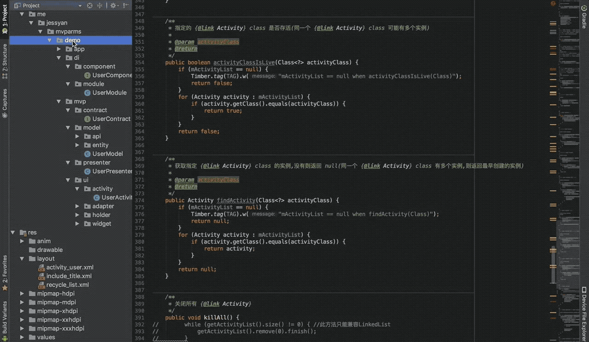
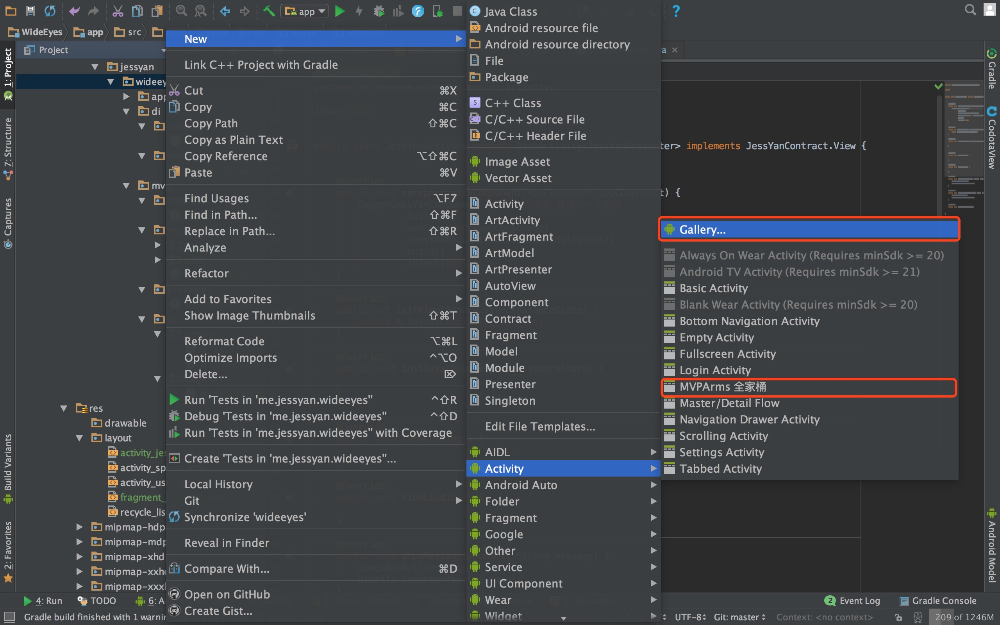

**A template for Android Studio to create [MVPArms](https://github.com/JessYanCoding/MVPArms) and [MVPArt](https://github.com/JessYanCoding/MVPArt) Page** 

**MVPArmsTemplate** 和 **MVPArtTemplate** 是 [**JessYan**](https://github.com/JessYanCoding) 为强大的 [**MVPArms**](https://github.com/JessYanCoding/MVPArms) 以及 [**MVPArt**](https://github.com/JessYanCoding/MVPArt) 打造的一系列高度可配置且炒鸡炫酷的插件式模版, 可以为每个业务页面一键自动生成 **File**、**Xml**, 还可以自定义配置文件名、布局名和用于文件生成的目标包路径, 并且每一个文件都可以控制生成与否

> **Tips: 若您基于本模板修改并且开源于网络, 请注明出处, 尊重开源, 才有人愿意开源, 谢谢!**

此模板会持续保持更新新的内容并同步兼容最新的 **AndroidStudio 稳定版**, 如果最新的模板代码不能兼容您的 **AndroidStudio 旧版本**, 请自行升级  **AndroidStudio** 到最新的稳定版, 或者自行回滚模板代码到能兼容旧版本的代码 (因为模板也是和 **AndroidStudio** 的版本同步更新的, 但也可能模板第一次提交兼容的版本都高于您的 **AndroidStudio** 旧版本), 此模板由于会随时更新新的内容, 所以不可能为每个 **AndroidStudio** 版本都维护一个分支, 这将极大的增加我的工作量, 所以在受益于模板带来的便利的同时, 也请尊重我的决定, 请不要提关于 **AndroidStudio 旧版本** 不兼容的 **Issues**, 谢谢

## 如何安装？

请将 **MVPArmsTemplate** (如果使用的是 **MVPArt** 请复制 **MVPArtTemplate** 文件夹) 这个文件夹复制到 **AndroidStudio Activity** 模版的存放路径(其他模版同理), 请注意是复制整个文件夹, 不是里面的内容!

**AndroidStudio Activity** 模版存放路径 (**请注意是放在 activities 文件夹里, 不是 gradle-projects 文件夹!!!**):

* Windows : AS安装目录/plugins/android/lib/templates/activities

* Mac : /Applications/Android Studio.app/Contents/plugins/android/lib/templates/activities

**最后记得重启 AndroidStudio !**

## 如何使用?

一图胜千言, 两个红色的选项都可以打开模板, 至于快捷键自己百度, **Mac** 是 **Command + n**

## 注意事项

* 原则上在任何包下都可以点击上面的按钮生成文件, 您在哪个包下点击生成文件, **Root Package Name** 的值就是哪个包, 下面的 **Activity Package Name**, **Presenter Package Name** 的默认值 (根据 **MVPArms Demo** 的包结构) 都是根据这个 **Root Package Name** 联动的, 如上图, 以我 **MVPArms Demo** 的包结构, **Presenter** 应该是放在 **.mvp.presenter** 下的, 但是现在 **Presenter Package Name** 的值却显示的是 **.app.mvp.presenter**, 明显和预期的输出包名不一致, 所以您最好在您的根包名下点击生成文件 (如 **me.jessyan.wideeyes**), 当然这些输出包名都是可以修改, 您不一定要使用我的默认的输出包名, 因为每个人的包结构都不一样, 所以包名可配置是刚需       

* 生成 **Activity** 以及 **Fragment** 前, 必须填写 **Layout Name**, 您可以自行生成布局后, 再将布局名填写到 **Activity/Fragment Layout Name**, 也可以使用本模版自动生成布局, 自动生成布局请将 **Generate Activity/Fragment Layout** 勾选上 (默认勾选), 如果您已经自行生成了布局, 不想使用自动生成布局, 那请不要勾选 (一定要注意, 因为这个是默认勾选的)

